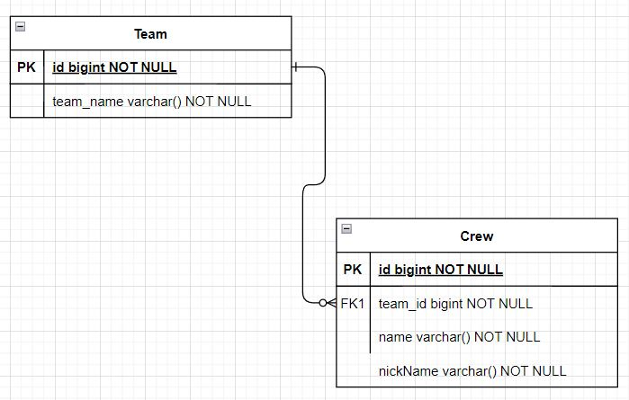

> 이 글은 우테코 달록팀 크루 '[리버](https://github.com/gudonghee2000)'가 작성했습니다.

## JPA 등장배경

1990년대 인터넷이 보급되면서 온라인 비지니스가 활성화 되었다.
자연스럽게, 온라인 비지니스에서 DB에 데이터를 저장하고 가져올때 사용할 Connection Connector에 대한 니즈가 높아졌다.
그래서 각 언어들에서 DB Connection을 지원하는 API 기술들이 등장하였다. 이후에 Spring에서는 DB Connection을 좀 더 쉽게 관리하는 Spring JDBC API를 만들고 지원하였다. (이외에도 Query문을 XML파일을 통해 관리하게끔 도와주는 Mybatis도 등장하였음)
하지만, 여전히 쿼리문을 개발자가 직접 작성해야하는 등 다양한 문제를 가지고 있었다.
그래서 JAVA 진영에서는 개발자가 쿼리문을 직접 작성하지 않아도 프레임워크 내부에서 지원해주는 ORM(Object Relational Model)기술인 JPA가 등장하였다.
그렇다면, JPA 이전에 개발자들이 직접 쿼리문을 작성하던 SQL 중심적인 개발의 단점은 무엇이 있을까?
아래에서 살펴보자.

## SQL 중심적인 개발의 단점

#### 1. 쿼리문 무한 반복과 지루한 코딩

JDBC API는 쿼리문을 개발자들이 직접 작성 해야한다.
그래서 개발자들은 쿼리문을 작성하는 지루한 작업을 개발 과정에서 무한반복해야한다.

#### 2. 객체의 필드가 추가되면 모든 쿼리문을 수정해야한다.


위 그림과 같이 SQL 중심적인 개발에서는 객체의 필드가 변경되면 해당하는 모든 쿼리문을 찾아 개발자가 수정해야한다.

#### 3. 객체와 관계형 DB의 패러다임의 불일치

객체라고 하면 떠오르는 키워드는 무엇이 있을까?
캡슐화, 협력, 의존, 상속, 참조 등의 기술이 있다. 그런데, DB에서는 이러한 기술들이 없다.
적용되는 기술들의 패러다임 불일치로 인해 개발자들은 SQL 지향적인 개발을 할 수 밖에 없다.
아래에서 자세히 살펴보자.

## 객체와 관계형 DB의 패러다임 차이

객체와 관계형 DB는 연관관계를 통해 작업을 수행한다는 공통점을 가진다.
하지만 연관관계를 맺는 패러다임의 차이를 가진다.

객체는 상속, 참조를 통해 연관관계를 맺는다.
반면 관계형 DB는 PK, FK를 통해 연관관계를 맺는다.
이때, 연관관계를 맺는 방식의 차이로 발생하는 문제점을 코드와 함께 살펴보자.

```java
public class Crew {
   private Long id;
    private String name;
    private String nickName;
    private Team team;
}

public class Team {
   private Long id;
    private String team_name;
}
```

위와 같이 `Crew` 객체가 `Team` 객체를 필드로 가지고 참조한다고 하자.
객체지향적인 관점에서, `Crew`와 `Team`의 관계를 위와 같이 표현하는것은 자연스럽다.

하지만, DB에서는 `Crew`가 `Team`을 참조한다는 개념이 없다.
그래서 위 객체들을 가지고 DB의 `Crew`테이블과 `Team`테이블의 관계를 맺을때, 아래와 같이 `PK` 값인 id를 `FK`로 가지도록 구현 하여야한다.


연관관계에 대해서 객체의 구조와 DB의 구조가 달라진다는 것이다.

그렇다면 객체지향적인 연관관계를 가진 객체들을 DB에 저장 할 때,
DB의 연관관계로 변경하는 것이 왜 문제가 될까?

## 객체와 RDB의 연관관계 차이가 가져오는 문제

위에서 봤던 `Crew`와 `Team`의 객체 모델링을 다시한번 살펴보자.

```java
public class Crew {
   private Long id;
    private String name;
    private String nickName;
    private Team team;
}

public class Team {
   private Long id;
    private String team_name;
}
```

위와 같이 모델링된 `Crew`와 `Team`을 DB에 저장한다고 한다면 다음의 과정이 필요하다.
DB에 접근하고자 하는 Dao 객체는 `Crew`객체를 분해하고 각자 `Crew` 테이블과 `Team` 테이블에 대한 쿼리를 작성해야한다. 단순히 `Crew`의 객체정보를 저장하는데 3가지 과정을 거쳐야한다.

이러한 복잡한 과정을 피하는 방법은 없을까?
아래 코드를 살펴보자.

```java
public class Crew {
   private Long id;
    private String name;
    private String nickName;
    private Long team_id;
}

public class Team {
   private Long id;
    private String team_name;
}
```

위와 같이 DB 테이블 구조에 맞추어 `Crew`와 `Team` 객체를 설계하는 방법이있다.
이러한 객체 모델링은 Dao 객체를 통해 데이터를 DB에 저장 할 때, `Crew` 객체를 분해하는 과정을 삭제 할 수 있다.
객체가 DB 구조에 맞추어 설계되어 있기 때문이다.

**하지만, 객체 모델링을 할 때 객체가 서로 참조하는 객체지향적인 개발이 아닌
DB 테이블구조에 맞추어 개발하는 SQL 중심적인 개발을 하게 된다는 문제를 가진다.**

객체와 관계형 DB의 연관관계의 패러다임 차이는 객체를 객체답지 못하게 만든다는 것이다.
그렇다면, 패러다임의 차이를 해결하는 방법은 없을까?

## JPA

객체와 관계형 DB의 패러다임의 차이로 인해 우리는 객체지향적인 프로그래밍을 하지못하고 DB에 종속적인 개발을 하게된다.
이러한 문제를 해결하기 위해 JAVA진영에서는 JPA를 제공한다.

JPA를 통해 개발자는 더이상 쿼리문을 반복적으로 작성하거나 유지보수하는 것을 신경쓰지 않아도 된다.
왜냐하면 JPA가 쿼리문을 작성해주기 때문이다.
그리고 SQL 중심적인 개발에서 벗어나 객체지향적인 개발을 할 수 있게 된다.
왜냐하면 패러다임의 불일치를 JPA가 내부적으로 맵핑해주기 때문이다.

다음 포스팅에서는 JPA의 작동 메커니즘을 자세히 살펴보자.
