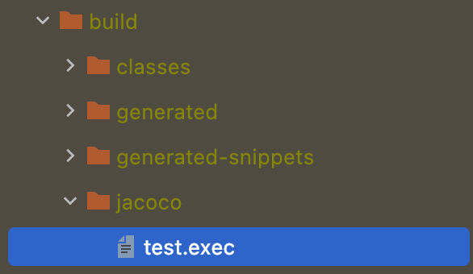
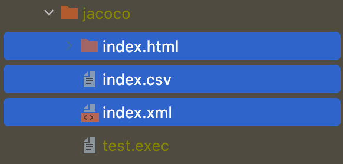

> 이 글은 우테코 달록팀 크루 [후디](https://github.com/devHudi)가 작성했습니다.

## 코드 커버리지란?

코드 커버리지란, 테스트 코드가 프로덕션 코드를 얼마나 실행했는지를 백분율로 나타내는 지표입니다. 즉, 테스트 코드가 실제로 프로덕션 코드를 얼마나 몇 퍼센트 검증하고 있는지를 나타냅니다. 코드 커버리지를 통해 현재 작성된 테스트 코드의 수가 충분한것인지 논의할 수 있습니다.

더 자세한 내용은 제가 작성한 [코드 커버리지(Code Coverage)란?](https://hudi.blog/code-coverage/) 포스팅을 참고해주세요! 😊

## Jacoco란?

Jacoco는 자바 진영에서 프로젝트의 코드 커버리지를 분석하고, 보고서를 만들어주는 역할을 하는 코드 커버리지 프레임워크입니다. 달록팀은 이번에 Jacoco를 도입하여 코드 커버리지를 분석하고, 코드 커버리지가 일정 수준 이하라면 빌드가 실패하도록 설정하였습니다. 이 과정을 여러분께 공유드립니다.

## 프로젝트에 Jacoco 적용하기

```groovy
plugins {
    // ...
    id 'jacoco'
}

// ...

jacoco {
    toolVersion = "0.8.7"
}
```

위와 같이 `build.gradle` 파일에서 Jacoco를 플러그인으로 가져오고, 버전을 설정해줍니다.

## 커버리지 보고서 생성하기

### 바이너리 보고서 생성

Jacoco 플러그인을 불러왔다면, 프로젝트의 테스트 코드를 한번 실행해봅시다.



그럼 위와 같이 **build → jacoco** 에서 `test.exec` 파일이 생성된 것을 확인할 수 있습니다. 해당 파일은 Jacoco가 테스트 코드를 실행하고, 코드 커버리지를 분석하여 만들어준 보고서 파일입니다.

이 파일은 바이너리 파일이라서 일반적인 방법으로 우리가 읽을 수 없습니다.

### XML, CSV, HTML 파일로 보고서 생성

하지만 Jacoco는 위에서 생성한 바이너리 커버리지 (`test.exec`) 파일을 사람이 읽을 수 있는 XML, CSV, HTML 파일로도 생성하는 기능을 제공합니다.

Jacoco Gradle 플러그인은 `jacocoTestReport` 라는 태스크가 있습니다. 이 태스크는 바이너리 보고서를 사람이 읽기 좋은 형태로 출력해주는 역할을 합니다. 아래와 같이 XML 파일을 생성하도록 태스크를 작성합니다.

```groovy
jacocoTestReport {
    reports {
        xml.enabled true
        csv.enabled true
        html.enabled true

        xml.destination file("${buildDir}/jacoco/index.xml")
        csv.destination file("${buildDir}/jacoco/index.csv")
        html.destination file("${buildDir}/jacoco/index.html")
    }
}
```

> 위에서 `${buildDir}` 은 빌드 디렉토리 경로를 의미합니다.

테스트가 이미 실행되어 `test.exec` 파일이 생성되었다고 가정하고, 아래 명령을 통해 `jacocoTestReport` 태스크를 실행하고 XML, CSV, HTML 파일을 얻어봅니다.

```bash
$ ./gradlew jacocoTestReport
```



build → jacoco 에서 `index.xml` `index.csv` 파일, 그리고 `index.html` 디렉토리가 생성된 것을 확인할 수 있습니다. `html` 파일은 `index.html` 디렉토리 내부 존재합니다.

XML과 CSV파일은 소나큐브등과 연동할 때 주로 사용되며, HTML 파일은 사람이 직접 커버리지를 확인할 때 사용됩니다. HTML 파일을 열어보면 아래 사진과 같이 보고서를 눈으로 확인할 수 있습니다.


> jacocoTestReport에 대한 자세한 내용은 [https://docs.gradle.org/current/dsl/org.gradle.testing.jacoco.tasks.JacocoReport.html](https://docs.gradle.org/current/dsl/org.gradle.testing.jacoco.tasks.JacocoReport.html) 를 참고해주세요.

### 테스트가 끝난뒤 바로 jacocoTestReport 실행하기

test 태스크가 끝난 다음에 jacocoTestReport 를 실행하는 2번의 과정은 조금 번거롭습니다. 아래와 같이 설정하면, 테스트가 끝나면 곧바로 jacocoTestReport가 실행되게 만들수 있습니다. 아래와 같이 test 태스크에 추가합니다.

```groovy
test {
    // ...
    finalizedBy 'jacocoTestReport'
}
```

Gradle에서 `finalizedBy` 를 사용하면, 해당 태스크가 끝나고 성공 여부와 관계없이 명시한 태스크를 이어 실행하도록 설정할 수 있습니다.

## 빌드가 성공하는 커버리지 기준 설정

Jacoco Gradle 플러그인에서는 `jacocoTestCoverageVerification` 이라는 태스크가 존재합니다. 이 태스크에서 규칙을 설정하여 프로젝트의 코드 커버리지가 규칙을 통과하지 않으면 빌드가 실패하도록 만들 수 있습니다. 아래는 달록팀의 설정입니다.

```groovy
jacocoTestCoverageVerification {
    violationRules {
        rule {
            enabled = true
            element = 'CLASS'

            limit {
                counter = 'LINE'
                value = 'COVEREDRATIO'
                minimum = 0.75
            }
        }

        // ...

        rule {
            // 규칙을 여러개 추가할 수 있습니다.
        }
    }
}
```

`rule` 블럭 내부에서 아래와 같은 속성으로 규칙을 정의할 수 있습니다.

### enabled

규칙의 활성화 여부를 나타냅니다. 기본 값은 `true` 입니다.

### element

커버리지를 체크할 단위를 설정합니다. 아래와 같은 옵션이 있습니다.

- `BUNDLE` : 패키지 번들 (전체 프로젝트)
- `CLASS` : 클래스
- `GROUP` : 논리적 번들 그룹
- `METHOD` : 메소드
- `PACKAGE` : 패키지
- `SOURCEFILE` : 소스파일

기본값은 `BUNDLE` 입니다.

### counter

코드 커버리지를 측정할 때 사용되는 지표입니다. 아래와 같은 옵션이 있습니다.

- `LINE` : 빈 줄을 제외한 실제 코드의 라인 수
- `BRANCH` : 조건문등의 분기 수
- `CLASS` : 클래스 수
- `METHOD` : 메소드 수
- `INSTRUCTION` : 자바 바이트코드 명령 수
- `COMPLEXITY` : 복잡도

기본값은 `INSTRUCTION` 입니다.

## 보고서 생성 후 커버리지 만족 검사

조금 전, `finalizedBy` 속성으로 `test` 태스크가 실행되고 `jacocoTestReport` 가 실행되도록 설정했습니다.

이어서 `jacocoTestReport` 태스크가 실행된 이후 `jacocoTestCoverageVerification` 가 바로 실행되어 테스트가 실행되고, 커버리지가 기준 미달이면 빌드가 실패되도록 흐름을 만들어봅시다.

```groovy
jacocoTestReport {
    // ...

    finalizedBy 'jacocoTestCoverageVerification'
}
```

간단히 위처럼 `jacocoTestReport` 에 추가해주면 끝입니다.

## 코드 커버리지 분석 대상 제외

예외 클래스, DTO 클래스 등 굳이 테스트를 하지 않아도 되는 클래스들이 있습니다. 이런 클래스까지 포함하여 코드 커버리지를 계산하면 코드 커버리지가 낮게 나올 것 입니다. 이런 클래스를 분석 대상에서 제외할 수 있습니다.

### jacocoTestReport

`jacocoTestReport` 태스크에서는 보고서에 표시되는 클래스 중 일부를 제외할 수 있습니다.

```groovy
jacocoTestReport {
    // ...
    afterEvaluate {
        classDirectories.setFrom(
                files(classDirectories.files.collect {
                    fileTree(dir: it, excludes: [
                            '**/*Application*',
                            '**/*Exception*',
                            '**/dto/**',
                            // ...
                    ])
                })
        )
    }
    // ...
}
```

제외 대상 파일의 경로를 [Ant 스타일](https://ant.apache.org/manual/dirtasks.html)로 작성합니다.

### jacocoTestCoverageVerification

`jacocoTestCoverageVerification` 에서는 코드 커버리지를 만족하는지 확인할 대상 중 일부를 제외할 수 있습니다. `jacocoTestReport` 에서 작성한 것과 다르게 파일의 경로가 아닌 패키지 + 클래스명을 적어주어야 합니다. 와일드 카드로 `*` (여러 글자) 와 `?` (한 글자) 를 사용할 수 있습니다.

```groovy
jacocoTestCoverageVerification {
    violationRules {
        rule {
            // ...

            excludes = [
                    '*.*Application',
                    '*.*Exception',
                    '*.dto.*',
                    // ...
            ]
        }
    }
}
```

## 참고

- [https://techblog.woowahan.com/2661](https://techblog.woowahan.com/2661/)
- [https://bottom-to-top.tistory.com/36](https://bottom-to-top.tistory.com/36)
