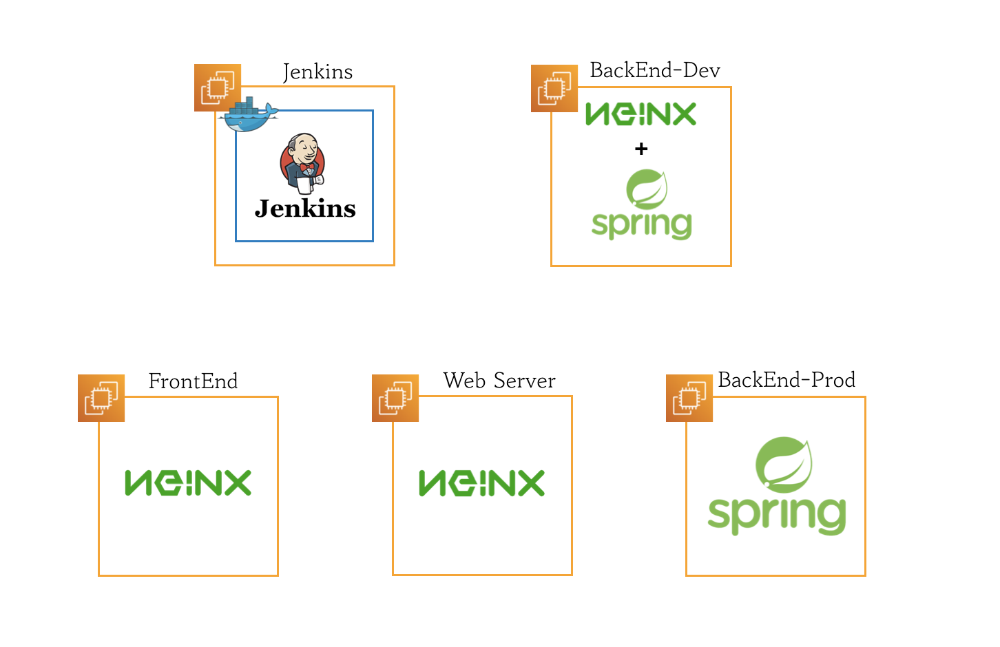
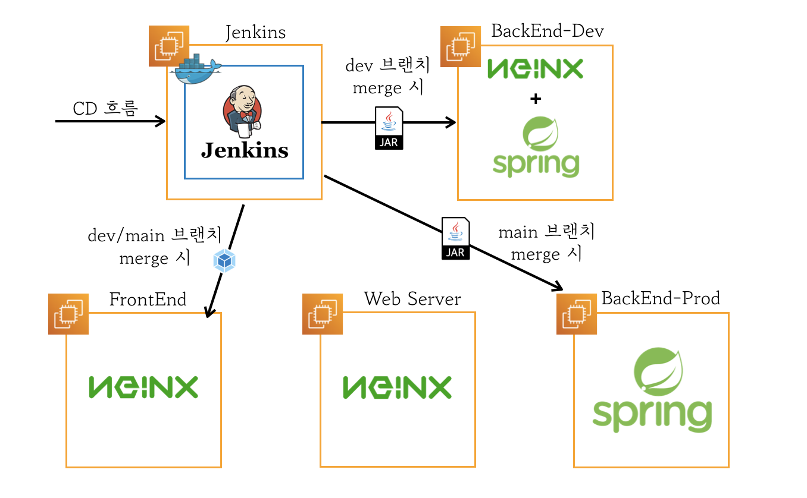
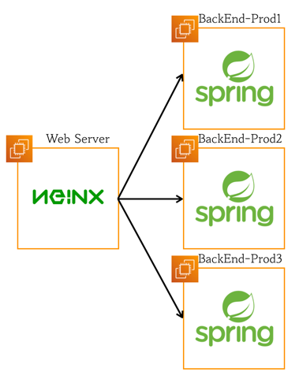

> 이 글은 우테코 달록팀 크루 [파랑](https://github.com/summerlunaa)이 작성했습니다.

## 전체적인 구조

배포 과정을 다루기 전에 전체적인 구조부터 살펴볼게요.

총 5개의 EC2를 사용하고 있습니다. 하나하나 살펴보겠습니다.

### 1. Jenkins

젠킨스를 위한 인스턴스입니다. 젠킨스는 설정이 필요한 부분이 많아 도커 위에 젠킨스를 띄워놓았습니다.

### 2. FrontEnd

프론트엔드 배포를 위한 인스턴스입니다. 여기선 Nginx가 정적 파일을 처리하는 역할을 합니다.

### 3. BackEnd Dev

실제 배포 전 테스트를 위한 백엔드 개발 서버입니다. 한 인스턴스 안에 Nginx와 Spring 함께 넣어두었습니다.

### 4. Web Server

리버스 프록시 역할을 하는 Nginx가 있습니다. 프론트엔드에서 받은 요청을 백엔드 서버로 전달합니다.

- 리버스 프록시란? [https://hudi.blog/forward-proxy-reverse-proxy/](https://hudi.blog/forward-proxy-reverse-proxy/)

### 5. BackEnd Prod

운영를 위한 백엔드 서버입니다. WS에서 받은 요청을 실제로 처리하여 응답을 전달합니다.

## CD 흐름

CD 흐름은 위와 같습니다. github의 webhook이 merge를 감지하면 젠킨스에 알려줍니다. 흐름은 두 가지 케이스로 나뉩니다.

1. dev 브랜치가 머지된 경우

프론트엔드 서버와 백엔드 dev 서버로 빌드된 파일을 보냅니다.

2. main 브랜치가 머지된 경우

프론트엔드 서버와 백엔드 prod 서버로 빌드된 파일을 보냅니다.

## 도커를 제거한 이유

배포 구조를 개편하면서 젠킨스를 제외한 모든 EC2 인스턴스에서 도커를 제거하였습니다. 도커를 제거한 이유는 크게 두 가지입니다.

1. depth가 깊어지면서 관리 포인트가 늘어나고 설정을 수정하기가 과하게 복잡하고 힘들어진다.
2. 도커 안에 Nginx를 띄우니 EC2가 무거워진다.

도커를 통해 얻을 수 있는 장점보다 단점이 훨씬 뚜렷하여 도커를 제거하였습니다. 필요성을 느껴서 기술을 도입한 것이 아니라 남들 다 하니까, 별 생각 없이 기술을 도입했을 때의 문제점을 절실히 깨달은 순간이었습니다.😅 그래도 이번 기회로 도커를 직접 다뤄보고 장점과 단점을 몸소 느낄 수 있어서 좋았습니다.

젠킨스의 경우 설정이 복잡하여 도커를 사용하는 것이 오히려 장점이 더 크다고 느껴 도커를 빼지 않았습니다. 추후에 여력이 된다면 백엔드 배포 서버를 여러 개 띄우고 도커 이미지를 통해 동일한 설정으로 관리해보는 것도 좋을 것 같다는 생각이 들었습니다.

## 백엔드 서버와 Web Server를 나눈 이유

기존의 백엔드 서버를 개발 서버로 전환하고, 운영 서버를 새로 만들면서 백엔드 서버와 web server를 분리했습니다. 그 이유는 아래와 같습니다.

1. Nginx 서버를 따로 두면서 리버스 프록시의 장점을 누릴 수 있다.
2. 추후 백엔드 서버 확장에 유리하다.
3. 여러 개의 백엔드 서버를 두더라도 https를 위한 ssl 인증서 발급 절차를 web server에서 한 번만 진행해도 된다.

현재는 두 개를 나눈 장점을 100% 느낄 수 없지만 앞으로 백엔드 서버를 추가할 경우에 매우 편할 것으로 예상하고 있습니다.
