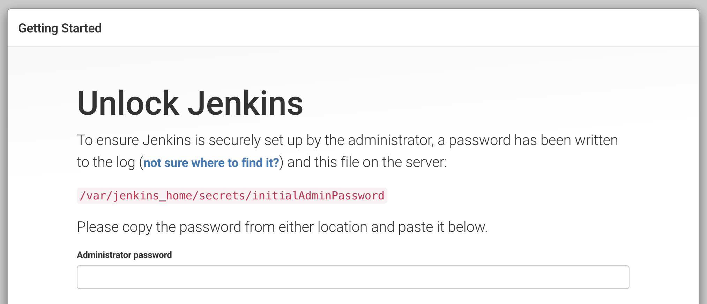
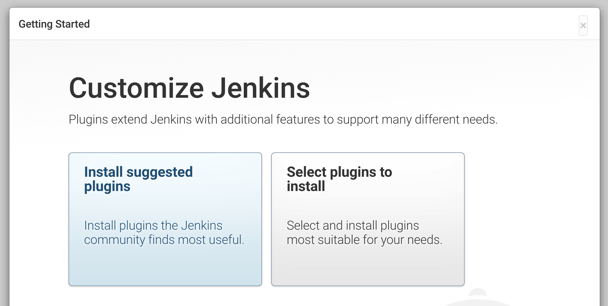

> 이 글은 우테코 달록팀 크루 [후디](https://github.com/devHudi)가 작성했습니다.

안녕하세요, 우테코 달록팀 후디입니다. 이번 스프린트에서는 저는 배포와 CI/CD와 같이 인프라와 관련된 태스크에 집중하고 있습니다.

지난번 포스팅으로 달록팀이 쉘 스크립트를 통해 배포 자동화를 구축한 이야기를 했었죠. 하지만 새로운 기능이 병합될 때 마다 SSH로 EC2 인스턴스에 접속하여 쉘 스크립트를 **매번 실행해야한다는 단점**이 존재했습니다. 따라서 저희 팀은 메인 브랜치에 기능이 새로 병합 될 때마다 자동으로 감지하고, 스프링 어플리케이션을 `jar` 파일로 빌드하여 배포하는 환경이 필요하다고 느꼈습니다. 따라서 **CI/CD 도구를 도입**하기로 결정했습니다.

이번 포스팅에서는 달록이 EC2 환경에서 도커를 사용하여 젠킨스를 설치한 방법에 대해서 정리합니다.

## 젠킨스 도입 배경


달록은 CI/CD 도구로 **Jenkins**를 선정하였습니다. 위 사진은 시중에 배포되어있는 여러 CI/CD 도구의 구글 트렌드 분석 결과입니다. 파란색이 Jenkins 인데요, **압도적으로 높은 관심도**를 유지하고 있습니다.

아무래도 달록팀 모두가 CI/CD에 익숙하지 않아 가장 사람들이 많이 사용하고, 그에 따라 **생태계가 넓고 레퍼런스가 많은 도구**를 선정하는 것이 좋다고 판단하였습니다. **레퍼런스가 많아** 초기 학습 비용이 적게 들고, 이슈가 발생했을때에도 **트러블슈팅이 비교적 쉽다**고 생각했습니다.

## 도커

달록팀은 EC2 인스턴스에 **도커를 사용하여** 젠킨스 컨테이너를 띄웠습니다. 도커를 사용하지 않고 젠킨스를 우분투에 직접 설치한다면 해주어야할 환경 설정이 가득합니다. 젠킨스를 돌리기 위한 JDK 설치, 젠킨스 설치, 젠킨스 포트 설정, 방화벽 설정 등등...

하지만 도커를 사용하면 이런 **환경 설정 없이 간단한 명령어 몇가지로 젠킨스를 설치하고 서버에 띄울 수 있습니다.**

도커는 서비스를 운용하는데 필요한 실행환경, 라이브러리, 소프트웨어, 코드 등을 컨테이너라는 단위로 가상화하는 컨테이너 기반 가상화 플랫폼입니다. 도커를 사용하면 EC2 인스턴스에는 미리 **도커라이징(Dockerizing)**된 이미지를 다운로드 받고 도커를 통해 실행하기만 하면되며, 해당 컨테이너가 어떤 환경을 필요로 하는지 전혀 알 필요가 없습니다.

> 더 자세한 내용은 제가 작성한 [이론과 실습을 통해 이해하는 Docker 기초](https://hudi.blog/about-docker/)를 읽어보시면 좋을 것 같습니다 🤭

### 우분투에 도커 설치

> 달록팀은 EC2 t4g.micro 인스턴스에 우분투 22.04 (ARM 64) 환경을 사용하고 있습니다.

> 아래 설치 방법은 [도커 공식 도큐먼트](https://docs.docker.com/engine/install/ubuntu/)에서 제공되는 내용입니다.

#### 레포지토리 셋업

아래 명령을 통해서 우분투의 `apt`의 패키지 인덱스를 최신화하고, `apt`가 HTTPS를 통해 패키지를 설치할 수 있도록 설정합니다.

```shell
$ sudo apt-get update
$ sudo apt-get install \
    ca-certificates \
    curl \
    gnupg \
    lsb-release
```

#### 도커의 공식 GPG 키 추가

```shell
$ sudo mkdir -p /etc/apt/keyrings
$ curl -fsSL https://download.docker.com/linux/ubuntu/gpg | sudo gpg --dearmor -o /etc/apt/keyrings/docker.gpg
```

#### 레포지토리 셋업

```shell
$ echo \
  "deb [arch=$(dpkg --print-architecture) signed-by=/etc/apt/keyrings/docker.gpg] https://download.docker.com/linux/ubuntu \
  $(lsb_release -cs) stable" | sudo tee /etc/apt/sources.list.d/docker.list > /dev/null
```

#### 도커 엔진 설치

아래 명령을 실행하면 가장 최신버전의 도커 엔진이 설치됩니다.

```shell
$ sudo apt-get update
$ sudo apt-get install docker-ce docker-ce-cli containerd.io docker-compose-plugin
```

#### 도커 설치 확인

```shell
$ sudo docker run hello-world

Hello from Docker!
This message shows that your installation appears to be working correctly.
...
```

위 명령을 실행하여 위와 같이 `Hello from Docker!` 메시지가 출력되면 성공적으로 도커 설치가 완료된 것 입니다. 다음 단계로 넘어가볼까요? 🤗

## 젠킨스 컨테이너 실행

### 젠킨스 이미지 다운로드

```shell
$ docker pull jenkins/jenkins:lts
```

위 명령을 통해 Jenkins LTS(Long Term Support) 버전의 이미지를 다운로드 받습니다.

### 젠킨스 컨테이너 띄우기

```shell
$ sudo docker run -d -p 8080:8080 -v /jenkins:/var/jenkins_home --name jenkins -u root jenkins/jenkins:lts
```

위 명령을 통해 다운로드 받은 젠킨스 이미지를 컨테이너로 띄울 수 있습니다. 사용된 각 옵션을 간단히 알아볼까요?

- **-d** : 컨테이너를 **데몬**으로 띄웁니다.
- **-p 8080:8080** : 컨테이너 외부와 내부 포트를 **포워딩**합니다. 좌측이 호스트 포트, 우측이 컨테이너 포트입니다.
- **-v /jenkins:/var/jenkins_home** : 도커 컨테이너의 데이터는 **컨테이너가 종료되면 휘발**됩니다. 도커 컨테이너의 데이터를 보존하기 위한 여러 방법이 존재하는데, 그 중 한 방법이 **볼륨 마운트**입니다. 이 옵션을 사용하여 젠킨스 컨테이너의 `/var/jenkins_home` 이라는 디렉토리를 호스트의 `/jenkins` 와 마운트하고 데이터를 보존할 수 있습니다.
- **--name jenkins** : 도커 컨테이너의 이름을 설정합니다.
- **-u root** : 컨테이너가 실행될 리눅스의 사용자 계정을 root 로 명시합니다.

### docker-compose 사용하기

하지만 위와 같은 명령어를 모두 외우고 있다가, 도커 컨테이너를 실행할 때 마다 입력하게 된다면 굉장히 번거롭겠죠. 따라서 도커는 docker-compose 라는 것을 지원합니다. 도커 컴포즈는 여러 컨테이너의 실행을 한번에 관리할 수 있게 도와주는 도커의 도구입니다. 하지만 저희와 같이 하나의 컨테이너만 필요한 상황에서도 유용하게 사용할 수 있죠.

```shell
$ sudo apt install docker-compose
```

위 명령을 이용하여 `docker-compose` 를 설치합니다.

그리고 도커를 실행할 경로에 `docker-compose.yml` 이란 파일을 만들고, 아래의 내용을 작성해줍니다.

```yaml
version: "3"
services:
  jenkins:
    image: jenkins/jenkins:lts
    user: root
    volumes:
      - ./jenkins:/var/jenkins_home
    ports:
      - 8080:8080
```

생성한 `docker-compose.yml` 이 존재하는 경로에서 아래의 명령을 실행하면 복잡한 명령 없이도 도커 컨테이너를 실행할 수 있습니다.

```shell
$ sudo docker-compose up -d
```

> -d 옵션은 컨테이너가 데몬으로 실행됨을 의미합니다.

## 젠킨스 설정

도커를 사용하여 젠킨스 컨테이너가 EC2 인스턴스에 성공적으로 띄워졌다면, EC2의 퍼블릭 IP를 통해 외부에서 접속할 수 있을 것 입니다. localhost:8080으로 접속하면 아래와 같은 화면이 보일 것 입니다.



```shell
$ sudo docker logs jenkins
```

위 명령을 사용하면, `jenkins` 컨테이너에 출력된 로그를 확인할 수 있습니다. 젠킨스를 최초로 설치하고 실행하면 사진에서 요구하는 initial admin password를 출력해주는데요, 로그를 확인해봅시다.

```
*************************************************************
*************************************************************
*************************************************************

Jenkins initial setup is required. An admin user has been created and a password generated.

Please use the following password to proceed to installation:


XXXXXXXXXXXXXXXXXXXXXXXXXXXXXXXX


This may also be found at: /var/jenkins_home/secrets/initialAdminPassword

*************************************************************
*************************************************************
*************************************************************
```

위에서 표시된 `XXXXXXXXXXXXXXXXXXXXXXXXXXXXXXXX` 를 웹사이트에 넣어주시면 됩니다.

혹은 아래의 명령으로 `jenkins` 컨테이너 내부에 직접 접속하여, `/var/jenkins_home/secrets/initialAdminPassword` 파일의 내용을 조회하는 방법도 있습니다.

```shell
$ sudo docker exec -it jenkins /bin/bash
$ cat /var/jenkins_home/secrets/initialAdminPassword
```



그 다음 위 화면에서 Install suggested plugins를 클릭하여 추천되는 플러그인을 설치합니다. 그 이후 요구되는 여러 정보의 입력을 끝 마쳐주세요.

```
System.setProperty('org.apache.commons.jelly.tags.fmt.timeZone
```

이후 대시보드에서 **Jenkins 관리 > Script Console** 에서 위의 스크립트를 입력하여 타임존을 서울로 설정하기만 하면, 젠킨스 기본 설정이 완료됩니다! 🎉

## 마치며

다음 포스팅에서는 달록이 젠킨스를 이용하여 어떻게 배포 자동화 프로세스를 구축하였는지 작성해보도록 하겠습니다. 많은 기대 부탁드립니다 🙏
