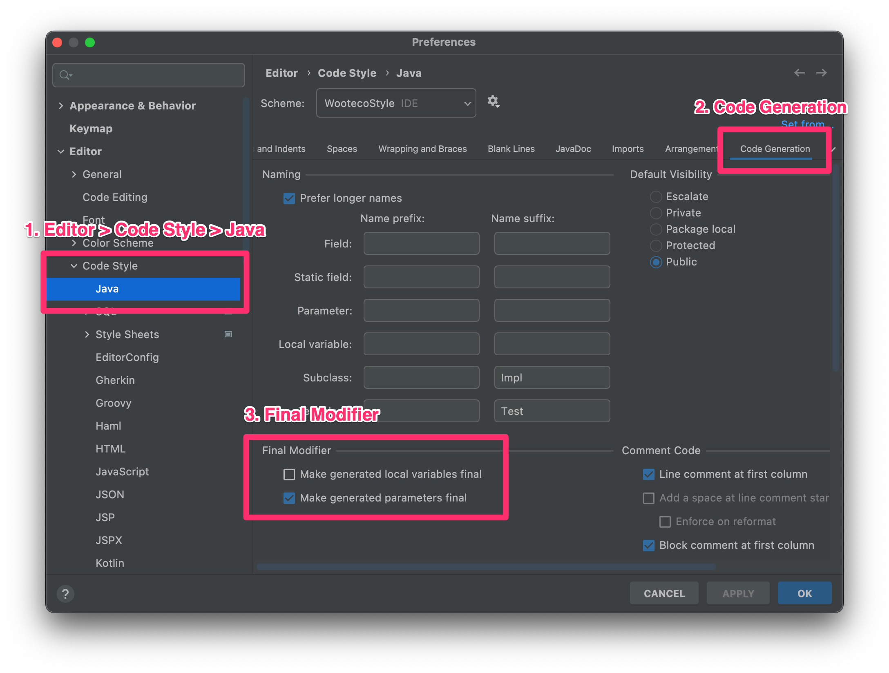

> 이 글은 우테코 달록팀 크루 [후디](https://github.com/devHudi)가 작성했습니다.

## 배경

우테코 레벨3 달록 팀에서 메소드의 파라미터에는 반드시 `final` 키워드를 붙이도록 컨벤션을 정했습니다. 이유는 무엇일까요? 일반적으로 가변적인 변수는 프로그램의 흐름을 예측하기 어렵게 만듭니다. 따라서 변수를 가변적으로 만드는 것이 중요한데, 자바에서는 변수의 재할당을 막기 위해 `final` 키워드를 사용합니다. 물론 `final` 키워드 하나만으로 완전한 불변을 보장하도록 만들수는 없지만, 어느정도 예측 가능한 코드를 만드는데에는 도움이 됩니다.

이는 메소드의 파라미터에도 적용됩니다. 아래의 코드는 `Memo` 객체를 생성하기 위한 생성자입니다. `value` 라는 String 값을 전달받아 객체 필드에 할당합니다.

```java
public Memo(String value) {
    validateLength(value);

    value = "hello"; // 예상치 못한 코드

    this.value = value;
}
```

하지만 위처럼 예상치 못한 코드가 추가되면 어떻게 될까요? `value` 필드에는 개발자가 의도하지 못한 값이 할당될 것 입니다.

```java
public Memo(final String value) {
    validateLength(value);

    value = 1; // error: final parameter value may not be assigned

    this.value = value;
}
```

이를 보완하기 위해서 위처럼 메소드 파라미터에 `final` 키워드를 붙이면, 재할당 시 컴파일 에러가 발생하여 예상치 못한 동작을 사전에 방지할 수 있을 것 입니다.

## IntelliJ 설정하기

하지만, 저희는 아직 메소드 파라미터에 `final` 키워드를 붙이는 습관이 들어있지 않았습니다. 따라서 IDE의 도움이 필요한데요, 다행히도 IntelliJ에서 메소드 추출 리팩토링을 할 때 생성되는 메소드 파라미터에 자동으로 `final` 키워드를 붙여주는 옵션을 발견하였습니다.



맥 기준으로 Preferences → Editor → Code Style → Java 페이지에서 Code Generation 탭을 클릭합니다. 해당 탭의 하단에 ‘Final Modifier’ 에서 ‘Make generated parameters final’ 을 체크해줍니다. 위와 같이 옵션을 변경하면 메소드 추출 시 파라미터에 자동으로 `final` 키워드가 생성되는 모습을 확인할 수 있습니다 😊
